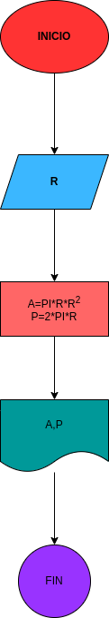

# # EJercicio No.1

## Calcular el área y el perimetro de un circulo de radio R.

# ANALISIS

Variabes de entrada (input)

R: Radio de círculo

Variables de proceso y salida (precessing, storage, output)

A: Área del círculo
P: Perímetro del círculo

# DISEÑO

# CONSTRUCCION
